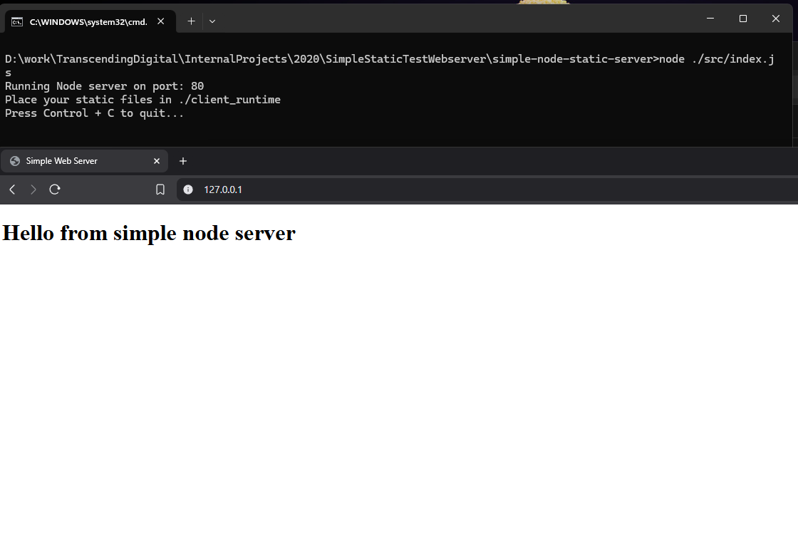

# simple-node-static-server
This is a simple nodeJS web server example for quickly testing static or SPA apps.
If you understand the basics of node it is much easier to setup a quick web server this way than using a heavy weight LAMP stack such as XMPP.

### Setup ###
* Install node with npm.
* Clone this repository and run "npm install" to install the express dependency use npm (the node package manager).
* Make sure no other services are running on port 80.
* You can quickly run on Windows with runOnWindows.bat.
* Alternatively you can manually run with the command "node ./src/index.js".
* Place any static files in client_runtime directory.

### Testing ###
When running the runOnWindows.bat file or running the command manually you can open a browser and navigate to http://127.0.0.1.
You should see results similar to the screen shot below.

